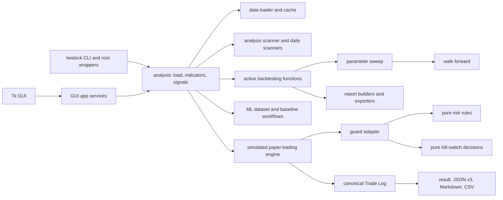

# Repository Architecture Review

## A. Executive summary

The repository feels cluttered because a mature package layout coexists with many root-level compatibility wrappers, several generations of CLI/report entry points, and one genuinely parallel backtest implementation. The wrappers are intentional compatibility debt: tests and prior roadmap decisions preserve imports and script execution from the repository root while the supported user path is the `twstock` console command. They should not be deleted without a versioned deprecation window.

The clearest actual duplication is `src/tw_stock_tool/backtest/engine.py` plus `src/tw_stock_tool/strategies/base.py`. Current CLI, GUI, parameter-sweep, walk-forward, artifact, and simulated-paper-trading workflows use `src/tw_stock_tool/backtesting/`; only dedicated tests use the alternate class-based path. The other major risks are responsibility concentration in `data/data_loader.py` (provider fallback, normalization, cache, and orchestration), the large GUI controller/service pair, and repeated CLI parameter assembly.

No unresolved P0 issue was found after the Trade Log change. The previously silent simulated pending-fill outcomes are now terminal audit events. Cleanup should proceed in this order: inventory public compatibility, decide the alternate backtest path, separate data-provider/cache orchestration, consolidate CLI argument builders, then split report and GUI responsibilities only when those areas are otherwise changing.

Priority counts: **P0: 0, P1: 3, P2: 6, P3: 3.**

## B. Current architecture map



- **Data loading:** CLI, GUI services, and analysis call `data.data_loader.download_tw_stock`. That module selects symbols/providers, normalizes frames, manages cache policy, and returns validated historical data.
- **Analysis and signals:** `analysis.analysis` composes the data loader, indicators, and standard signal generation. `backtesting.strategies` supplies strategy-specific DataFrame transforms used by backtest and simulated-paper-trading CLIs.
- **Scanning:** `analysis.scanner` performs multi-stock concurrent analysis, deterministic filtering, and explicit error-row capture. `scanners/` contains narrower candidate, breakout, risk-warning, and daily-watchlist workflows; these overlap in vocabulary but not yet in contracts.
- **Backtesting:** application workflows call `backtesting.backtest.run_backtest_result` or its compatibility dictionary wrapper. It uses standard signals and next-bar-open pending execution. `backtest.engine.BacktestEngine` is a separate class/protocol implementation with a different result model and is test-only in current repository call sites.
- **Parameter sweep:** `backtesting.parameter_sweep` builds parameter grids, executes the active backtest path, and ranks in-sample results.
- **Walk forward:** `backtesting.walk_forward` splits chronological train/test windows, chooses parameters on train data, runs test windows, and also contains report/export/CLI-era helpers.
- **Reports:** `reports/` shapes DataFrames, renders Markdown/Excel, and writes files. Some modules keep builder, renderer, file I/O, and error translation together.
- **Simulated paper trading:** `paper_trading.engine` is the full-history single-symbol compatibility wrapper; `stepper` owns per-bar lifecycle behavior; `runtime` owns shared portfolio and pending orders; `coordinator` performs fill-first, chronological, symbol-sorted multi-symbol stepping. The canonical append-only Trade Log is exposed through result and artifact boundaries.
- **Risk manager and kill switch:** `risk/` contains pure snapshots, rules, configuration, and aggregation. `kill_switch/` contains pure state/decision models. `simulated_paper_trading_guard/` adapts simulated order/portfolio state to both systems and injects the decision provider into paper trading.
- **CLI:** `cli.twstock_cli` is a dispatching façade that forwards remaining arguments to established command modules. Individual command modules own parsers, orchestration, output, and exception-to-exit behavior.
- **GUI:** `gui.gui_app` owns Tk widget construction, validation, submission, task display, and lifecycle. `gui.app_services` adapts package workflows into GUI-safe result dictionaries; `gui_tasks` owns background task state.
- **ML:** `ml/` builds offline datasets and baseline models, with AI scan and walk-forward workflows consuming the same historical analysis stack. It does not participate in execution or broker activity.

## C. Directory and module inventory

| Group | Current responsibility and main callers | Public API / compatibility | Observed issues | Recommended disposition |
|---|---|---|---|---|
| Root Python wrappers | Redirect legacy imports/scripts to package or CLI modules; external scripts and wrapper tests | Compatibility surface; several wrappers are explicitly smoke-tested | Visually noisy and import redirection via `sys.modules` is non-obvious | KEEP until a public-import inventory and deprecation release exist |
| `analysis/` | Single-stock composition, indicators, signals, scan orchestration; called by CLI, GUI, reports, ML | Widely used internal/package surface plus root wrappers | Scanner combines concurrency, row shaping, filtering, and sorting, but behavior is deterministic | KEEP; refactor only with scanner feature work |
| `data/` | Price providers/fallback/cache and stock-list update; called by analysis and utilities | User-visible reliability boundary | `data_loader.py` combines provider calls, normalization, cache, fallback, and diagnostics | REFACTOR into provider/cache/orchestrator seams without changing policy |
| `scanners/` | Daily candidate and specialized breakout/risk-warning models | Called by daily-watchlist flows | Naming overlaps `analysis.scanner`; ownership distinction is undocumented | DOCUMENT_ONLY, then investigate consolidation if contracts converge |
| `backtesting/` | Active function engine, metrics, results, serialization, sweep, walk forward, strategy comparison | Primary runtime and artifact API; root wrappers rely on it | `walk_forward.py` is 603 lines; reporting and CLI-era concerns remain mixed | KEEP active path; split opportunistically |
| `backtest/` | Alternate class/protocol engine | No current application caller; protected by dedicated tests | Duplicates execution semantics and defines a second `BacktestResult` | MERGE_CANDIDATE after compatibility decision |
| `strategies/` | Abstract base for alternate class engine | Test-only current consumers | Duplicates the callable strategy convention in `backtesting.strategies` | MERGE_CANDIDATE with alternate engine decision |
| `reports/` | Builders, Markdown/Excel renderers, file output | Called by CLI, GUI services, and root wrappers | Several modules mix shaping, rendering, I/O, and user-facing exceptions | REFACTOR per report, not repository-wide |
| `paper_trading/` | Models, runtime, stepper, coordinator, result, v1-v3 serialization, exports | Stable compatibility collections and public package exports | Serializer/exporters are necessarily schema-dense; no aggregate multi-symbol result | KEEP; document schema and avoid speculative aggregate API |
| `risk/` | Pure risk snapshots, limits, decision aggregation | Public package boundary with extensive tests | Some mutable models and repeated numeric validation, but dependency direction is clean | KEEP |
| `kill_switch/` | Pure activation and decision models | Public package boundary | Small, isolated, fail-closed | KEEP |
| `simulated_paper_trading_guard/` | Adapts portfolio/order state to risk and kill switch; provider injection | Public package boundary; workflow compatibility helpers | Several adjacent provider types increase surface, but each represents a distinct pricing context | KEEP; document provider selection |
| `cli/` | Unified dispatch plus individual parsers/orchestrators | Primary user interface; heavily smoke-tested | Repeated strategy/backtest arguments and dictionary assembly; broad exception translation varies | REFACTOR shared argument builders in a narrow phase |
| `gui/` | Tk UI, service adapters, asynchronous task state | Root wrapper and GUI tests protect behavior | 696-line UI class and 428-line service module create high change coupling | REFACTOR by feature tab/service when GUI work resumes |
| `ml/` | Offline dataset, baseline model, AI scan/walk-forward | Research-only scripts and root wrappers | Report/export and orchestration logic appears beside model work | KEEP; separate only when ML workflow changes |
| `ui/` | Explicit read-only UI boundary | Safety-oriented public boundary | Small and appropriately isolated | KEEP |
| `utils/` | Config, output writers, diagnostics, batch verification, console lock | Cross-cutting internal/public helpers plus wrappers | Broad bucket, but current modules are cohesive | KEEP |
| `tests/` | 1,343 unit/compatibility tests after Trade Log | Defines many compatibility promises | Large files mirror large production surfaces; some imports use `src.tw_stock_tool` | REFACTOR test imports during the owning subsystem phase |
| `docs/`, README, CI, packaging | User guidance, roadmap, architecture records, test matrix, dependencies | Release-facing | README is very large; `requirements.txt` duplicates `pyproject.toml`; CI runs tests only | DOCUMENT_ONLY now; address in narrow release-engineering phases |

## D. Classification matrix

| Classification | Priority | Files or symbols | Evidence | Compatibility risk / coverage | Recommended action | Safe now? | Future phase |
|---|---:|---|---|---|---|---|---|
| KEEP | — | `backtesting/backtest.py`, `BacktestResult` | CLI, GUI, sweep, walk-forward, artifacts, and paper converter call this path | High; broad suite coverage | Treat as canonical until an explicit decision says otherwise | Yes | Existing |
| MERGE_CANDIDATE | P1 | `backtest/engine.py`, `strategies/base.py` | Repository search finds only dedicated tests as consumers; result and cost semantics differ from active engine | High if external imports exist; focused tests only | Inventory releases/imports, then adapt or deprecate the alternate path | No | A2 |
| REFACTOR | P1 | `data/data_loader.py` | 448 lines own providers, fallback, validation, cache, console capture, and orchestration | High; 551-line test module | Extract provider adapters and cache policy behind current function contract | No | A3 |
| REFACTOR | P1 | `gui/gui_app.py`, `gui/app_services.py` | 696-line controller plus 428-line services span all tabs/workflows | High; GUI/app-service tests | Split by tab/use-case while retaining `TwStockToolGUI` and service façade | No | A6 |
| REFACTOR | P2 | CLI strategy/backtest parsers | Same initial-capital, fee, tax, position, MA, and RSI plumbing appears in several commands | High; CLI smoke tests | Add shared argument-registration and namespace-to-parameters helpers | No | A4 |
| REFACTOR | P2 | `reports/daily_report.py`, `backtest_report.py`, `walk_forward_report.py`, `parameter_sweep_report.py` | Builder, Markdown/Excel renderer, file I/O, and error translation coexist | Medium/high; report tests | Split one report at a time into data, render, and file boundaries | No | A5 |
| DEPRECATE | P2 | Root wrappers | Dozens of small redirectors are intentional and some are explicitly tested | High for external scripts/imports | Publish inventory, warn first, remove only in a major/versioned window | No | A1/A7 |
| INVESTIGATE | P2 | `analysis/scanner.py` vs `scanners/` | Both describe scanning/candidates, but callers and result contracts differ | Medium; scanner/daily tests | Document ownership; merge only shared normalization if duplication is proven | No | A5 |
| REFACTOR | P2 | Broad `except Exception` in `gui/app_services.py`, data/report workflows | Many boundaries convert arbitrary failures to strings or generic errors | Medium; tests cover common failures, not every classification | Define subsystem errors and narrow catches one workflow at a time | No | A3/A6 |
| MOVE_CANDIDATE | P2 | CLI-era/export helpers inside `backtesting/walk_forward.py` | 603-line module spans core window evaluation and peripheral concerns | High; walk-forward and CLI tests | Keep core evaluation in module; move rendering/CLI helpers only with compatibility aliases | No | A5 |
| DOCUMENT_ONLY | P3 | `requirements.txt` and `pyproject.toml` | Dependency lists currently match but require manual synchronization | Medium install risk | Name one source of truth and add a consistency test or generation note | Yes, docs only | A8 |
| DOCUMENT_ONLY | P3 | `.github/workflows/python-tests.yml` | Runs Python 3.11/3.12 unit tests; no whitespace/static checks | Low runtime risk | Add `git diff --check` or a tiny whitespace check when CI policy changes | No | A8 |
| DOCUMENT_ONLY | P3 | README and historical phase records | README exceeds 2,000 lines and architecture history contains superseded snapshots | Low runtime, medium discoverability | Keep stable anchors; move historical closeout records to phase docs in a docs-only branch | No | A8 |
| KEEP | — | `risk/`, `kill_switch/`, guard adapter | Pure models/rules and explicit injected adapters; no CLI/DataFrame dependency in risk rules | High; 366 related tests | Preserve dependency direction | Yes | Existing |
| KEEP | — | Paper runtime/stepper/coordinator | Shared stepper preserves fill-first timing and coordinator symbol order | High; 235 paper tests plus guard/risk groups | Continue using this as canonical simulated lifecycle | Yes | Existing |
| KEEP | — | Root wrappers that look redundant | Tests protect report wrappers and import shims; roadmap explicitly retained them | High | Do not classify as dead code without release/import evidence | Yes | A1 |

## E. Priority backlog

### P0

No open P0 item was found. The simulated fill data-loss/silent-failure path was fixed by the Trade Log implementation in this branch.

### P1

1. **Choose the canonical backtest engine.** Inventory external imports of `tw_stock_tool.backtest.engine`; document semantic differences; add adapter tests; deprecate or merge the class engine in a separate branch.
2. **Separate data providers from cache/orchestration.** Extract provider-specific fetch functions behind the current `download_tw_stock` result/error contract; leave fallback order unchanged.
3. **Split GUI work by use case.** Move one tab's validation/submission logic at a time into a service/controller while preserving the public GUI façade and task runner.

### P2

1. Add shared backtest/strategy CLI argument builders and replace one command at a time.
2. Split one report module into payload builder, pure renderer, and filesystem writer.
3. Publish a root-wrapper/public-import compatibility inventory and deprecation policy.
4. Document the boundary between `analysis.scanner` and `scanners/` before any merge.
5. Introduce narrower subsystem exceptions for one data or GUI workflow at a time.
6. Move non-core helpers out of `backtesting.walk_forward` with compatibility imports.

### P3

1. Declare whether `pyproject.toml` or `requirements.txt` owns dependency versions and verify consistency.
2. Add a lightweight whitespace check to CI.
3. Move superseded phase closeout history out of living architecture documents without breaking README/doc links.

## F. Compatibility and migration plan

- **Root wrappers:** first inventory each import and executable behavior; publish the canonical package/CLI replacement; add `DeprecationWarning` only for imports where warnings will not break scripts; retain wrappers for at least one documented release window; remove only in a versioned breaking release.
- **Public imports:** derive a supported API list from package `__all__`, README examples, root wrappers, and package-boundary tests. Add import smoke tests before moving symbols.
- **CLI commands:** keep command names, flags, defaults, exit codes, and output filenames stable. Shared parser helpers must be internal and snapshot-tested through current `--help` tests.
- **JSON artifacts:** simulated paper trading now writes schema v3 with `audit_log`; readers retain v1 and v2 support. Any future schema change must remain strict about unknown fields and add old/current round trips.
- **Generated reports:** keep existing Orders, Fills, and Rejections Markdown/CSV outputs. The v3 Trade Log section/file is additive. Do not rename existing basenames without aliases and release notes.
- **Tests:** migrate callers before deleting compatibility tests. Replace a wrapper test with its canonical-path test only in the same deprecation-removal branch.
- **Warnings/versioning/release notes:** warnings identify the replacement and earliest removal version. Release notes distinguish additive artifact fields from breaking removals and state the supported read versions.

## G. Proposed target structure

```text
src/tw_stock_tool/
  analysis/                 # indicators, signals, analysis composition
  data/
    providers/              # only after provider extraction is needed
    data_loader.py          # stable orchestration façade
    cache_manager.py
  backtesting/              # one canonical execution/result family
    backtest.py
    results.py
    metrics.py
    parameter_sweep.py
    walk_forward.py
    strategies.py
  paper_trading/            # current model/runtime/stepper/coordinator/artifacts
  risk/
  kill_switch/
  simulated_paper_trading_guard/
  reports/                  # split internally per report when touched
  scanners/                 # specialized scanners; ownership documented
  cli/
  gui/
    gui_app.py              # retained façade
    app_services.py         # retained façade; feature modules added as needed
  ml/
  ui/
  utils/
```

This target intentionally keeps most current directories. The only likely removal is the alternate `backtest/` plus `strategies/base.py`, and only after consumer inventory and migration. Provider/report/GUI submodules should be introduced by extraction from a real change, not as empty scaffolding.

## H. Recommended phased roadmap

1. **Phase A1 — public API and wrapper inventory:** enumerate supported imports/scripts and replacement paths; no deletion.
2. **Phase A2 — duplicate backtest decision:** compare semantics, external usage, and artifacts; choose adapt, deprecate, or retain with a documented distinct purpose.
3. **Phase A3 — data provider/cache boundary:** extract one provider path and keep fallback/cache behavior byte-for-byte compatible where practical.
4. **Phase A4 — CLI argument-builder consolidation:** centralize shared backtest/strategy flags behind existing parser behavior.
5. **Phase A5 — report and walk-forward separation:** split one high-change report or walk-forward peripheral boundary per branch.
6. **Phase A6 — GUI feature-controller extraction:** move one tab/use case at a time from the large controller/service pair.
7. **Phase A7 — wrapper deprecation and migration:** only after A1 evidence and a published compatibility window.
8. **Phase A8 — release-engineering and documentation hygiene:** dependency-source policy, whitespace CI, and historical-doc consolidation.

The repository remains offline/research oriented. None of these phases requires a broker interface, live account access, order submission, semi-automatic trading, automatic trading, or investment recommendations.