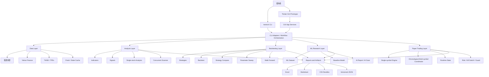
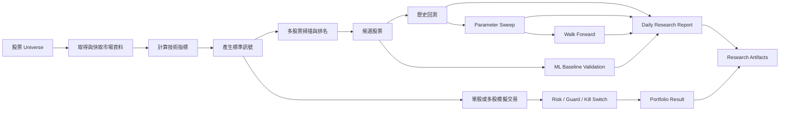
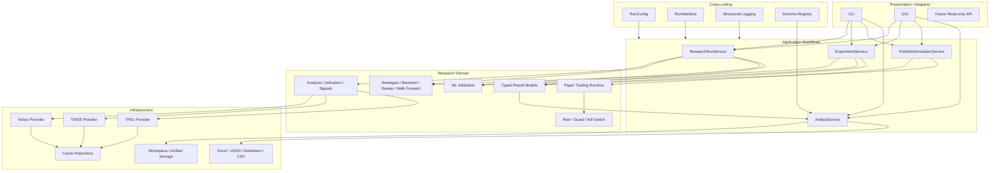

# tw_stock_tool 產品架構與後續開發計畫

## 1. 文件目的

本文件以產品經理與系統架構視角整理 `tw_stock_tool` 的：

- 目前產品定位與已完成功能。
- 現況功能方塊圖與主要資料流。
- 各模組成熟度與架構缺口。
- 建議的目標架構。
- Phase 55 之後的開發優先順序與驗收條件。

本文件描述的是產品與架構方向，不直接授權修改 production code。每一個實作 Phase 仍應依照既有流程進行範圍鎖定、測試、Reviewer Gate、CI Gate 與 Merge Gate。

### Baseline

- Repository：`Mike87117/tw_stock_tool`
- Baseline branch：`main`
- Baseline date：2026-07-26
- Current package version：`0.4.0`
- Current product boundary：歷史資料研究、策略驗證、離線模擬交易與研究 artifact
- Explicit non-goals：券商串接、真實下單、自動交易、投資建議與獲利保證

---

## 2. 產品經理結論

`tw_stock_tool` 已經從單一台股分析腳本，演進成具備完整研究鏈的離線台股研究平台。

目前已具備：

- 台股價格與股票清單取得。
- 技術指標與標準訊號。
- 單股分析與多股票掃描。
- Daily Research Report。
- Strategy Compare、Backtest、Parameter Sweep、Walk Forward。
- AI／ML baseline research workflow。
- 單股歷史模擬交易。
- 多股票 chronological portfolio simulation。
- Portfolio Risk、Kill Switch 與 Guard boundaries。
- JSON、Markdown、CSV、Excel artifacts。
- 統一 `twstock` CLI 與本機 GUI prototype。

下一階段不應優先增加更多指標、策略、AI 模型或 Broker API。

目前最重要的產品問題是：

> 已完成的能力很多，但仍缺少一個統一、可重現、可追蹤、可比較的研究工作區。

因此，建議下一個主題為：

# Phase 55：Research Workspace Foundation

---

## 3. 目前產品功能方塊圖



### 現況架構特性

優點：

- Domain 能力已相當完整。
- 回測與模擬交易已有明確的 historical research boundary。
- Artifact 已與執行流程分離，可進行離線 validate、inspect 與 export。
- Multi-symbol paper trading 已具備 chronological ordering、pending BUY reservation 與 portfolio risk controls。
- CLI、package installation 與主要命令已有 Python 3.11／3.12 CI smoke coverage。

主要問題：

- Workflow orchestration 分散在 CLI、reports、GUI services 與部分 domain modules。
- 不同產品線使用的 result model 與 schema 成熟度不一致。
- 使用者需要理解許多獨立命令，才能完成一條完整研究流程。
- 缺少統一 Run ID、Run Manifest、Workspace 與 Artifact Catalog。

---

## 4. 目前主要研究流程



這條流程已經具備大部分必要能力，但仍缺少一個統一的 application workflow，將分析、驗證、輸出與追蹤視為同一次 Research Run。

---

## 5. 現有模組責任

```text
src/tw_stock_tool/
├── analysis/                      指標、訊號、單股分析與多股票掃描
├── backtesting/                   策略、回測、策略比較、Parameter Sweep、Walk Forward
├── cli/                           統一 CLI router 與各命令 adapters
├── data/                          股票清單、資料來源、下載、快取與 smoke checks
├── gui/                           Tkinter GUI prototype、task runner 與 app services
├── kill_switch/                   Research-only kill-switch model boundary
├── ml/                            ML dataset、baseline model 與 AI scanner
├── paper_trading/                 模擬交易 models、runtime、engine、coordinator、results 與 artifacts
├── reports/                       Daily、Backtest、AI 與其他報告 workflow／renderers
├── risk/                          Pure risk snapshots、rules、decisions 與 configuration
├── simulated_paper_trading_guard/ Risk／kill-switch 到模擬交易的 adapter boundary
├── ui/                            Read-only UI boundary
└── utils/                         設定、診斷、輸出與共用工具
```

---

## 6. 各區域成熟度評估

| 區域 | 成熟度 | 產品與架構評估 |
| --- | ---: | --- |
| Data / Cache | 3/5 | 功能完整，但 `data_loader.py` 同時承擔過多責任 |
| Indicators / Signals | 4/5 | 純 DataFrame transformation 為主，邊界清楚 |
| Scanner | 4/5 | 有並行、錯誤列、篩選與 deterministic ranking |
| Backtest | 4/5 | Next-bar-open、metrics 與 structured result 已標準化 |
| Parameter Sweep / Walk Forward | 4/5 | 研究驗證完整，但缺少統一 experiment tracking |
| Daily Report | 3/5 | 功能豐富，但 workflow、validation、shaping 與 export 耦合偏高 |
| ML | 2.5/5 | Baseline 可用，但仍未整合成統一研究實驗產品線 |
| Single-symbol Paper Trading | 4.5/5 | Runtime、Trade Log、schema、serializer 與 exporter 完整 |
| Multi-symbol Portfolio | 4.5/5 | Chronology、reservation、risk 與 aggregate result 已完成 |
| Artifact | 4/5 | 各 artifact 成熟，但缺少統一 catalog 與關聯追蹤 |
| CLI | 4/5 | 功能完整，但使用體驗仍像多個獨立工具的集合 |
| GUI | 2/5 | 已具備 non-blocking task runner，但仍是 prototype |
| Product Management | 2/5 | Phase 紀錄詳細，但缺少正式 Epic、產品指標與 backlog hierarchy |

---

## 7. 已經做得很好的架構決策

### 7.1 Next-bar-open execution

Backtest 與 simulated trading 使用前一個 bar 的訊號，在下一個有效 bar 的 Open 執行，避免 same-bar signal／price look-ahead。

此契約應被視為高風險、不可輕易修改的核心交易語意。

### 7.2 Multi-symbol chronological coordinator

Multi-symbol simulation 不是依序跑完股票 A 再跑股票 B，而是建立共同時間軸：

1. 依時間順序處理。
2. 同一時間先處理 pending fills。
3. 再依 canonical symbol 的 deterministic order 建立與評估 candidate orders。

這避免了跨股票 full-history sequential execution 造成的 look-ahead。

### 7.3 Pending BUY exposure reservation

已接受但尚未成交的 BUY order 會保留 reserved notional，避免同一時間多筆 candidate 在成交前各自看到未被占用的 portfolio exposure。

### 7.4 Artifact execution separation

Artifact commands 操作既有 JSON，不重新抓取市場資料、不執行策略、不執行 backtest 或 simulated trading。

這個 boundary 應持續保留。

### 7.5 Fail-closed risk behavior

Risk configuration、reference price provider、portfolio exposure provider 或 schema validation 發生異常時，系統採用 fail-closed，而不是默默忽略風險錯誤。

---

## 8. 目前最重要的架構問題

## 8.1 Data Loader 是大型多責任模組

目前資料載入流程同時負責：

- 輸入驗證。
- 股票代號 `.TW`／`.TWO` fallback。
- Yahoo Finance provider。
- TWSE provider。
- TPEx provider。
- ROC date parsing。
- OHLCV normalization。
- cache read／write。
- fresh cache policy。
- stale cache policy。
- provider error aggregation。

問題不是目前功能不正確，而是任何新增 provider、修改 fallback 或調整 cache policy，都會增加同一模組的變更風險。

### 建議

建立 provider boundary，但保留既有 `download_tw_stock(...)` facade 與所有 user-visible behavior。

---

## 8.2 Application Workflow 邊界不足

目前完整流程散落在：

- CLI `main()`。
- Daily Report workflow。
- GUI app services。
- AI scanner。
- Simulated portfolio CLI。

例如一個 CLI 可能同時負責：

- 收集股票。
- 執行分析。
- 套用策略。
- 驗證 DataFrame。
- 執行 domain engine。
- 寫入 artifact。
- 重新讀取驗證。
- 顯示 terminal summary。

### 建議

新增 Application Service，使 CLI 與 GUI 只負責：

1. Parse input。
2. 呼叫 application workflow。
3. Render output／exit code。

---

## 8.3 Result Model 不一致

Paper Trading 已大量使用：

- Frozen／slotted dataclasses。
- 明確 error models。
- Versioned schemas。
- Serialization boundaries。
- Pure exporters。
- Filesystem boundaries。

但 Analysis、Scanner、Daily Report 與 ML 仍大量交換：

- `pandas.DataFrame`
- `dict[str, Any]`
- 字串欄位名稱

這些介面目前可用，但跨流程組合、schema evolution、GUI rendering 與 run tracking 會逐漸困難。

### 建議

不應立刻將所有 DataFrame 改成 dataclass，而應先在 application boundary 建立 typed run/result summaries。

---

## 8.4 Artifact 各自成熟，但缺少 Artifact Hub

目前已有：

- Daily Report schema v1。
- BacktestResult JSON artifact。
- Simulated Paper Trading schema v1／v2／v3。
- Simulated Portfolio schema v1。
- Markdown／Excel／CSV bundles。

但缺少：

- Run ID。
- 統一 artifact catalog。
- 產生時間。
- Source command／workflow。
- Data period。
- Strategy／configuration fingerprint。
- Artifact 間的 parent／child relationship。

---

## 8.5 GUI 仍是命令功能面板

目前 GUI 已能：

- 執行 Doctor 與 data source checks。
- 更新股票清單。
- 執行 Scan、Daily Report 與 Single Stock workflow。
- 管理 cache。
- 以 TaskRunner 避免阻塞 Tk main thread。

但仍缺少研究工具需要的：

- Workspace。
- 儲存設定。
- 執行歷史。
- Artifact browser。
- 結果比較。
- Run reproduction。
- Portfolio simulation UI。

---

## 8.6 技術 Phase 很完整，但產品 backlog 不完整

現有 Phase 文件非常適合：

- 鎖定 scope。
- 防止跨 Phase 擴張。
- 保護 serialization 與 trading semantics。
- 執行 Reviewer Gate／CI Gate／Merge Gate。

但產品管理上仍缺少：

- User problem。
- User story。
- Epic。
- Milestone。
- Success metrics。
- Feature dependencies。
- Product acceptance criteria。

### 建議

保留現有 Phase workflow，並在其上層增加：

```text
Product Goal
└── Epic
    └── Milestone
        └── Phase Planning
            └── Production / Test / Docs PR
```

---

## 9. 建議目標架構

不建議一次全面搬動所有 package。建議採用漸進式架構，在現有 domain modules 上增加 Application 與 Artifact 層。



### 建議新增目錄

```text
src/tw_stock_tool/
├── application/
│   ├── research_run.py
│   ├── experiment.py
│   ├── portfolio_simulation.py
│   └── artifact_service.py
│
├── artifacts/
│   ├── catalog.py
│   ├── manifest.py
│   ├── registry.py
│   └── workspace.py
│
└── data/
    ├── providers/
    │   ├── base.py
    │   ├── yfinance_provider.py
    │   ├── twse_provider.py
    │   └── tpex_provider.py
    ├── cache_repository.py
    └── data_loader.py
```

現有 `analysis`、`backtesting`、`paper_trading`、`risk` 等 domain packages 不需要立刻搬動。

---

## 10. Phase 55 開發 Roadmap

## Phase 55.0：Architecture Baseline 與 Product Backlog

### 目標

正式凍結目前架構、目標架構與產品 backlog hierarchy。

### 工作內容

- 建立 current-system architecture 文件。
- 建立 target-system architecture 文件。
- 補充主要 dependency direction。
- 盤點 CLI command 到 product workflow 的 mapping。
- 定義 public、internal、compatibility APIs。
- 建立 Product Epic／Milestone／Phase Issue templates。
- 定義後續 Phase dependency graph。

### 驗收條件

- 不修改 production runtime behavior。
- 所有現有測試通過。
- 每個 package 都有明確責任說明。
- 每個 CLI command 都能對應到一條 product workflow。
- 文件明確標記 authoritative source hierarchy。

---

## Phase 55.1：Market Data Provider Decomposition

### 目標

拆分 `data_loader.py`，但完整保留既有 `download_tw_stock(...)` API 與 user-visible behavior。

### 工作內容

- 建立 `MarketDataProvider` protocol 或等價 boundary。
- 拆出 Yahoo provider。
- 拆出 TWSE provider。
- 拆出 TPEx provider。
- 拆出 OHLCV normalization。
- 拆出 cache repository。
- 保留 fallback orchestration facade。

### 必須保留的 fallback 順序

```text
Fresh Cache
→ Yahoo Finance
→ Official TWSE / TPEx fallback
→ Stale Cache fallback
→ DataLoaderError
```

### 驗收條件

- CLI behavior 不變。
- Cache filename／path contract 不變。
- Stale-cache warning contract 不變。
- Existing error behavior 不變。
- Provider 可注入 fake implementation。
- 不使用 network 即可測試完整 fallback orchestration。
- `force_refresh` behavior 不變。
- Official fallback 仍受 auto-adjust 與 interval restrictions 約束。

---

## Phase 55.2：Research Run 與 Run Manifest

### 目標

讓每次研究執行都可以被重現、追蹤與比較。

### 建議新增模型

```text
RunConfig
RunManifest
DataSourceRecord
ResearchRunResult
ArtifactReference
```

### Manifest 至少記錄

- Run ID。
- 建立時間。
- Tool version。
- 股票 Universe。
- Canonical symbols。
- Period／interval。
- Auto-adjust／force-refresh。
- Strategy。
- Backtest parameters。
- Parameter Sweep configuration。
- Walk Forward configuration。
- ML configuration。
- Data source records。
- Fresh／stale cache usage。
- Success／failure／partial counts。
- Generated artifacts。

### 驗收條件

- Scan、Daily、Backtest 至少可產生 manifest。
- 同一次 Daily Pipeline 不重複下載同一股票資料。
- 相同設定能被清楚重建。
- CLI 與 GUI 可共用同一 Application Service。
- Manifest 不取代既有 artifact schema，而是建立 run-level metadata boundary。

---

## Phase 55.3：Artifact Hub 與 Workspace

### 目標

統一管理研究結果，而不是立即改掉既有 schema。

### 建議 Workspace layout

```text
workspace/
└── 2026-07-26_2330_ma-cross_<run-id>/
    ├── manifest.json
    ├── daily-report.json
    ├── backtest.json
    ├── portfolio.json
    ├── report.md
    └── tables/
```

### 建議 command direction

```bash
twstock run daily --config research.toml
twstock run inspect <run-id>
twstock artifact list
twstock artifact inspect <path>
twstock artifact validate <path>
```

以上 command 僅為產品方向，實際 CLI 名稱與 compatibility contract 必須在獨立 planning phase 鎖定。

### 驗收條件

- 不破壞既有 schema。
- 舊 artifact 仍可讀取。
- Artifact catalog 可辨識 result type 與 schema version。
- 每個新產生 artifact 可追溯至 manifest。
- Offline artifact operation 仍不得抓取市場資料或重新執行研究。

---

## Phase 55.4：Daily Report 模組拆分

### 目標

將大型 Daily Report workflow 拆成清楚責任。

### 建議拆分

```text
reports/daily/
├── pipeline.py
├── models.py
├── candidate_selection.py
├── backtest_validation.py
├── parameter_validation.py
├── walk_forward_validation.py
├── report_data.py
└── exporters.py
```

### 驗收條件

- 現有 CLI output 不變。
- Excel sheet names 不變。
- JSON schema 不變。
- Markdown section order 不變。
- 每個 validation step 可獨立測試。
- Pipeline 只負責 orchestration。
- Partial failure 與 Data Limitations behavior 不變。

---

## Phase 55.5：GUI 0.2 — Research Workspace

### 目標

將 GUI 從命令按鈕集合，升級為研究工作區。

### 建議主要畫面

#### Workspace

- 最近執行。
- Saved configurations。
- Artifact list。
- Run status。

#### Universe

- TWSE／TPEx selection。
- 股票清單。
- Stock limit／sample。
- Data availability。

#### Research Pipeline

- Scan。
- Daily Report。
- Backtest。
- Parameter Sweep。
- Walk Forward。

#### Experiments

- Strategy comparison。
- Parameter comparison。
- Equity curves。
- Out-of-sample metrics。

#### Portfolio Simulation

- 多股票 selection。
- Initial cash。
- Quantity／fees／tax／slippage。
- Risk caps。
- Positions／fills／rejections／audit log。

#### Data Health

- Provider status。
- Cache age。
- Stale-cache warning。
- Smoke checks。

### 驗收條件

- GUI 不直接呼叫 CLI parser。
- GUI 與 CLI 共用 Application Service。
- 背景任務都有 success／failure／cancel／error state。
- 可從 GUI 開啟既有 artifact，而不重新執行研究。
- GUI 維持 read-only／research-only product boundary。

---

## Phase 55.6：Experiment Comparison

### 目標

建立統一的策略研究實驗平台。

### 比較維度

- Strategy。
- Parameters。
- Stock／Universe。
- Data period。
- Backtest result。
- Walk Forward result。
- Benchmark。
- ML baseline。

### 核心輸出

```text
Experiment Summary
Strategy Comparison
Out-of-sample Results
Stability
Drawdown
Trade Count
Data Limitations
```

### 產品原則

- ML output 仍為 research baseline。
- ML 不直接產生投資建議或保證式 conclusion。
- In-sample ranking 與 out-of-sample validation 必須分開呈現。

---

## Phase 55.7：v0.5.0 Release

### 建議 Release 主題

> Reproducible Research Workspace

### 建議收錄

- Data provider boundary。
- Run Manifest。
- Workspace。
- Artifact Hub。
- Daily Report decomposition。
- GUI 0.2。
- Multi-symbol portfolio 正式納入 release notes。
- 完整 migration guide。

### Release Gate

- Python 3.11／3.12 full test suite。
- Installed package smoke。
- Console entrypoint smoke。
- Artifact compatibility tests。
- Schema read-back validation。
- Documentation／runtime consistency audit。
- Explicit Reviewer authorization before tag／GitHub Release／PyPI action。

---

## 11. 優先級排序

| 優先級 | 工作 |
| --- | --- |
| P0 | Architecture Baseline |
| P0 | Data Provider decomposition |
| P0 | Run Manifest／Reproducible Research |
| P1 | Artifact Hub／Workspace |
| P1 | Daily Report decomposition |
| P1 | GUI Research Workspace |
| P2 | Experiment Comparison |
| P2 | ML integration and quality improvements |
| P3 | 新技術指標與新策略 |
| 暫緩 | Broker Interface／真實下單 |

---

## 12. 目前不建議進行的工作

## 12.1 不要立即全面重排 package

全面搬動 `analysis`、`backtesting`、`reports` 等目錄，會造成大量 import、CLI、tests 與 compatibility surface 變更。

建議順序：

```text
新增 Application boundary
→ 讓既有 modules 逐步接入
→ Characterize public contracts
→ 最後才考慮 package relocation
```

## 12.2 不要優先增加更多策略

目前策略數量已足以驗證研究平台。增加策略無法解決：

- 結果不可追蹤。
- 執行不可重現。
- GUI 不完整。
- Artifact 分散。
- Data provider 耦合。

## 12.3 不要立即開發 Broker Interface

即使 Paper Trading、Risk 與 Kill Switch 已有良好基礎，真實交易仍需要額外完成：

- Account state reconciliation。
- Order idempotency。
- Partial fill handling。
- Exchange session model。
- Retry／timeout policy。
- Broker error recovery。
- Secret management。
- Real-time quote boundary。
- Human approval flow。
- Immutable external audit。
- Emergency shutdown。

在上述能力完成前，產品應持續保持歷史研究與離線模擬定位。

---

## 13. 建議產品指標

後續不應只追蹤測試數量，也應追蹤使用者流程與可重現性。

| 指標 | 建議目標 |
| --- | ---: |
| 新使用者完成第一份 Daily Report | 10 分鐘內 |
| Daily Pipeline 主要入口 | 1 個 command／GUI workflow |
| 同一 Research Run 重複下載同一股票資料 | 0 次 |
| 可追溯至 Run Manifest 的新 artifacts | 100% |
| CLI backward compatibility regression | 0 |
| 無法辨識來源或設定的新 artifact | 0 |
| GUI 未顯示的背景任務錯誤 | 0 |
| 相同設定重跑的 deterministic ordering | 100% |
| Artifact read-back validation | 100% |

---

## 14. 建議下一步

建議正式開發順序：

```text
Phase 55.0 Architecture Baseline
↓
Phase 55.1 Data Provider Decomposition
↓
Phase 55.2 Research Run Manifest
↓
Phase 55.3 Artifact Hub / Workspace
↓
Phase 55.4 Daily Report Decomposition
↓
Phase 55.5 GUI Research Workspace
↓
Phase 55.6 Experiment Comparison
↓
v0.5.0 Release
```

第一個 production-code 工作應是：

> 拆分 Data Provider，但保留 `download_tw_stock(...)` facade 與所有既有行為。

第一個產品能力工作應是：

> 建立 Run Manifest，讓 Scan、Daily、Backtest、Walk Forward、ML 與 Portfolio Simulation 可以被視為同一次可重現研究。

---

## 15. Product Epic 建議

### Epic A：Reliable Market Data Foundation

- Provider decomposition。
- Cache repository boundary。
- Source health records。
- Data provenance。

### Epic B：Reproducible Research Runs

- RunConfig。
- RunManifest。
- Shared analysis reuse。
- Deterministic run summaries。

### Epic C：Artifact Workspace

- Artifact catalog。
- Workspace layout。
- Schema registry。
- Cross-artifact relationships。

### Epic D：Research Workflow UX

- Unified application services。
- CLI workflow simplification。
- GUI Research Workspace。

### Epic E：Experiment Management

- Strategy comparison。
- Parameter comparison。
- Walk Forward／out-of-sample comparison。
- ML baseline comparison。

這五個 Epics 應成為 Phase 55 與 v0.5.0 的產品管理上層結構。